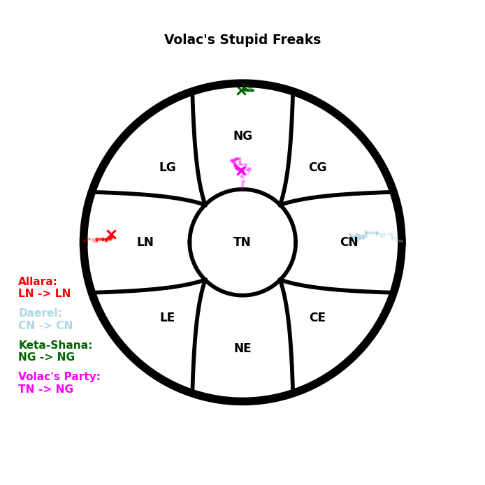

# AlignmentReporter
## An unexpected package critical bug provoked by incorrect versionning in packages is waiting to be fixed

A tool for DM to easily make __Alignment Change Graphs__ for their Campaigns, __with a save system__
to switch between parties. Originally just a part of a larger toolbox, I am currently making it a standalone project.
It is a bit old and need some changes (mainly using coroutines and C compilation).

The tool is quite simple in its way, but I will add a tutorial later. For testing, simply launche the __init__.py at
the root directory and enter a save file name. It will automatically load any existing file in the data folder if it
exists.
I have **already created two save files from personal games** (accessible with the names "**Celtaidd**" and "**Volac**").

The generated images are in the "***AlignmentReporter/out/***" directory, but a preview is loaded in the tool after each
image generation.

## System recommendations
This tool has been tested with the following setups. Please share any working or non-working setup you may use to
use this tool.

- *OS:*
    - ***Windows 10 (19041.928)***
    - ***Linux Mint 20.1 (Xfce)***
- *Python **3.8.5***


## Installation:
in the root directory
```python 
python -m pip install AlignR
```

## Typical usages:

### in terminal (***recommended***):

```
AlignR-Launch
```

### Python:
```python
import AlignmentReporter as AR; AR.launch()
```


## Typical Output



## Tutorial
*To be implemented*

## Known Issues
- GUI still freezes in Windows 10 when generating the image
- Color implementation will sometimes accept wrong inputs or refuse correct ones.

## Licence notice
Every ***.UI*** file contained in this project has been created with the **QtDesigner** software from the **Qt Company** under the **GPL-3.0 License**. *(see the [Official Qt website](https://www.qt.io/) for more informations)*.
